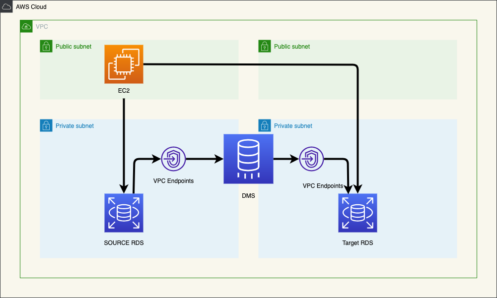

# AWS DMS を用いた MySQL レプリケーション構築（データベース移行）

<p align="center">
  
</p>


# 概要
このプロジェクトは、Terraform を使用して、AWS DMS (Database Migration Service) を用いた MySQL レプリケーションを構築するためのものです。

# 手順
下記のスクリプトを実行して、踏み台サーバーとターゲットサーバー用の SSH キーペアを生成します。
```
bin/make_sshkey
```
下記のスクリプトを実行して、Terraform を実行し、AWS リソースを作成します。
```
bin/terraform_apply
```
RDS インスタンス (mysql-source) にssh接続し、bin/init.sqlを実行して、レプリケーションに必要なデータを初期化します。(まだ実行されていない場合のみ)
```
bin/init.sql
```
下記のスクリプトを実行して、Terraform を実行し、AWS リソースを削除します。
```
bin/terraform_destroy
```

# 使用技術とサーバー
+ AWS DMS: データベース移行サービス
+ EC2: 仮想マシン
+ IAM: アクセス管理サービス
+ RDS: リレーショナルデータベースサービス

## ネットワーク周りの技術
+ VPC (Virtual Private Cloud): 複数のサブネットを持つVPCを作成し、各サブネットに適切なリソースを配置
+ サブネット: パブリックサブネットとプライベートサブネットを作成し、それぞれにEC2インスタンスやRDSインスタンスを配置
+ ルートテーブル: サブネットごとにルートテーブルを作成し、インターネットへのアクセスや他のサブネットへの通信を制御
+ セキュリティグループ: 各リソースに必要なポートを開放するセキュリティグループを作成します。
+ インターネットゲートウェイ: パブリックサブネットにインターネットゲートウェイを接続し、インターネットへのアクセスを許可

## サーバー
+ 踏み台サーバー: EC2 インスタンスを使用して構築します。ターゲットサーバーへの SSH 接続に使用されます。
+ ターゲットサーバ: RDS インスタンスを使用して構築します。レプリケーションの宛先となるデータベースです。

# 注意事項
このプロジェクトは、テスト目的でのみ使用してください。
本番環境で使用する場合は、セキュリティ要件を満たすように設定してください。

# 参考資料
+ AWS DMS ドキュメント: https://docs.aws.amazon.com/dms/latest/userguide/
+ Terraform ドキュメント: https://www.terraform.io/docs/

# 免責事項
このプロジェクトは、いかなる保証もなしに提供されます。著者は、このプロジェクトの使用によって生じた損害について一切の責任を負いません。
